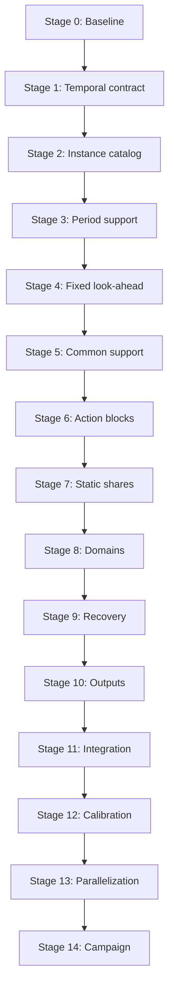

# Out-of-Sample Experiment Redesign Plan

**Project:** Stochastic Fair Energy Allocation  
**Document role:** Authoritative design specification and staged implementation roadmap  
**Status:** Approved design context; implementation proceeds only through separately authorized stage prompts  
**Last updated:** 2026-08-07

## 1. Purpose and authority

This document defines the target design for the out-of-sample (OOS) rolling-horizon experiment. It preserves the decisions that must remain consistent across implementation stages, identifies the current baseline, and establishes the dependencies and acceptance gates for the redesign.

This document provides **design context, not blanket implementation authority**. A stage-specific prompt must authorize each stage. When a stage prompt and this document differ, implementation must stop and the inconsistency must be resolved before code is changed. Later-stage requirements must not be implemented early merely because they are described here.

The redesign has five primary objectives:

1. separate the evaluation horizon, look-ahead horizon, and implementation step;
2. compare deterministic, two-stage, and multistage rolling-horizon methods under aligned information and common stochastic support;
3. build a reproducible structural-instance design with paired OOS evaluations;
4. report both economic performance and policy-aligned fairness performance; and
5. make the complete campaign auditable, scalable, and safely parallelizable.

## 2. Current implementation baseline

The current OOS module is additive to the repository and already provides:

- three controller types: `DETERMINISTIC_RH`, `TWO_STAGE_RH`, and `MULTISTAGE_RH`;
- six allocation/fairness configurations: `NONE`, `STATIC_DEMAND_SHARE`, `PEA`, `SA`, `LEXMMFPEA`, and `LEXMMFSA`;
- one verified shared-battery physical-model builder;
- one shared battery-mode binary per information state;
- sequential OOS simulation with physical action validation;
- deterministic random-stream separation;
- configuration, period, solver, and fairness outputs;
- warm-start support and formulation audits;
- smoke, preflight, and downstream validation workflows;
- the complete Stage-2 structural-instance catalog, controlled demand assignments and seed
  hierarchy; and
- the complete Stage-3 pure period-data support layer, deterministic-base isolation and
  schema-v2 structural manifest.

The current campaign runner is sequential. Its output writer produces aggregate files in one
shared output directory, so it is not safe for concurrent workers to write directly to the same
campaign files. The physical-model builder already forwards a positive `solver_threads` setting
to CPLEX, which provides the control needed to prevent nested solver parallelism in the future
parallel runner.

The current behavior that motivates the redesign is:

1. The simulator iterates over `1:template.T`.
2. At period `t`, each controller optimizes over the shrinking interval `t:template.T`.
3. Only period `t` is observed and implemented.
4. A fresh controller-specific look-ahead object is generated for every `(replication, t)` pair.
5. That object is reused across fairness policies for the same controller.
6. The look-ahead seed currently includes the controller, so two-stage and multistage future samples are independent.
7. The deterministic controller uses a conditional mean path generated separately from the stochastic controllers.
8. The terminal state-of-charge constraint is tied to `template.T`.
9. Structural instance factors and OOS replications are represented in the standalone manifest,
   but that manifest is not yet consumed by the active simulator.

The existing in-sample tree created while building the repository instance is a legacy/calibration object. It is not the conditional scenario tree used by the rolling-horizon multistage controller.

## 3. Binding terminology and notation

Let

\[
H=\texttt{evaluation\_horizon},\qquad
L=\texttt{lookahead\_horizon},\qquad
h=\texttt{implementation\_step}.
\]

The terms have the following meanings:

- **Evaluation horizon \(H\):** periods whose realized economic and fairness outcomes enter the OOS evaluation.
- **Look-ahead horizon \(L\):** consecutive periods represented in every rolling optimization.
- **Implementation step \(h\):** consecutive decisions committed and implemented before the next optimization.
- **Rolling start \(t\):** the first period of an implementation block.
- **Known prefix \(\mathcal K_t\):** realized periods known to every controller at rolling start `t`.
- **Structural instance:** fixed physical and demand-composition characteristics shared across OOS replications.
- **OOS replication:** one stochastic realized trajectory evaluated within a fixed structural instance.
- **Conditional support:** the common stochastic object generated for one structural instance, OOS replication, and rolling start.
- **Parallel task:** the smallest independently schedulable campaign bundle. Its preferred identity is the pair `(PairedBaseID, OOSReplicationID)`.
- **Task shard:** one isolated, atomically completed set of outputs produced by exactly one parallel task before deterministic campaign-level merging.
- **Repository instance horizon \(T_0\):** `template.T`, the unchanged horizon and deterministic
  base-profile length supplied by the repository instance.
- **Required period-support endpoint \(T^{\mathrm{support}}\):** the last abstract period for
  which the future rolling contract requires exogenous data.
- **Materialized data endpoint \(T^{\mathrm{data}}\):** the stored data endpoint,
  `max(T0, Tsupport)`, which retains the full repository profile even when the requested support
  is shorter.
- **Deterministic data block:** the price, deterministic PV reference and repository-generator
  basis shared by all eight battery × demand-regime × uncertainty variants of one
  `(base instance, structural draw)` cell and identified by `DeterministicDataID`.

A period is an **abstract model period**. Neither `h` nor any other rolling-horizon parameter defines minutes, hours, days, or a clock-time scale. The physical duration of a period remains encoded only in the underlying instance, including `template.delta`.

## 4. Binding global invariants

The following invariants apply to all stages.

### 4.1 Temporal structure

The admissible temporal parameters satisfy

\[
H\ge 1,\qquad L\ge 1,\qquad 1\le h\le \min\{H,L\}.
\]

`implementation_step` may be any integer satisfying these inequalities. It is not restricted to a fixed set and need not divide `evaluation_horizon`.

Rolling starts are

\[
\mathcal T(H,h)=\{1,1+h,1+2h,\ldots\}\cap\{1,\ldots,H\}.
\]

At rolling start \(t\), the full committed block is

\[
\mathcal B_t=\{t,\ldots,t+h-1\},
\]

and the evaluated portion is

\[
\mathcal E_t=\mathcal B_t\cap\{1,\ldots,H\}.
\]

The final full block may extend beyond \(H\). It must not be silently truncated for decision construction. Only its evaluated portion contributes to reported OOS metrics.

The moving look-ahead window is

\[
\mathcal L_t=\{t,\ldots,t+L-1\}.
\]

Therefore, the required period support ends at

\[
T^{\mathrm{support}}
=\max \mathcal T(H,h)+L-1.
\]

The repository instance horizon, evaluation horizon, moving look-ahead length, support endpoint
and materialized endpoint are separate quantities:

\[
T_0=\texttt{template.T},
\qquad
T^{\mathrm{data}}=\max\{T_0,T^{\mathrm{support}}\}.
\]

Stage 3 fixes one centralized abstract-period mapping for deterministic profile repetition:

\[
\kappa(\tau;T_0)=1+((\tau-1)\bmod T_0),
\qquad \tau\ge 1, T_0\ge 1.
\]

Every price row, deterministic PV-reference value and already-resolved household activity value
is preserved exactly on `1:T0` and, after `T0`, repeats its base entry at `kappa(tau; T0)`.
Individual PV, price, demand, controller and fairness functions must not duplicate the cycling
arithmetic. Extension never samples or regenerates deterministic values, never resamples a
Stage-2 household profile, and never calls the legacy independent `mixed` assignment rule.
`template.T` remains `T0`; it is not renamed as `H`, `L`, `Tsupport` or `Tdata`.

`template.delta` is preserved exactly. No energy, power, price or rate quantity is rescaled as a
consequence of repetition, and the mapping gives no clock-time or calendar meaning to `T0` or to
the repository profile labels.

The known prefix is

\[
\mathcal K_t=\mathcal B_t,
\]

and uncertainty begins at period \(t+h\). Every controller must receive the same realized values over \(\mathcal K_t\).

### 4.2 Rolling updating

A new conditional support is generated at every rolling start. The experiment does not keep one fixed tree for the entire OOS replication, and it does not prune or update the previous tree in place.

The new support is conditioned on the enlarged realized history. Warm starts may transfer decision information between successive solves, but they must never transfer or substitute the uncertainty structure.

### 4.3 Common support across methods

For structural instance \(i\), OOS replication \(r\), and rolling start \(t\), generate one common conditional stochastic object

\[
\mathcal S_{i,r,t}\mid\mathcal H_{i,r,t}.
\]

The three methods must be derived from this object:

- `MULTISTAGE_RH` uses the complete scenario tree and its intermediate nonanticipativity.
- `TWO_STAGE_RH` uses the same leaf paths and leaf probabilities, while removing intermediate nonanticipativity after the known prefix.
- `DETERMINISTIC_RH` uses the probability-weighted mean path derived from the same leaf support.

This alignment isolates the effect of information structure. The methods must not differ because they received unrelated Monte Carlo samples.

The support is common **within** a rolling iteration and regenerated **between** rolling iterations.

### 4.4 Pairing and random streams

Controller, fairness policy, solver phase, worker number, and execution order must never enter seeds for structural assignments, OOS paths, or conditional support.

The seed hierarchy must distinguish:

1. structural assignment generation;
2. OOS realized trajectories; and
3. conditional look-ahead support.

All controller–fairness combinations must be evaluated on the same structural instances and paired OOS paths. Battery levels should also share demand assignments and exogenous trajectories so that battery comparisons are paired.

For fixed base instance and structural draw, the deterministic repository base is also paired
across battery level, demand regime and uncertainty level. In particular, low/high uncertainty
variants must share exactly the same `nu`, `pv_det`, extended deterministic data, fixed household
assignment for their regime, and every non-uncertainty physical input. Their uncertainty labels,
`theta`, structural/pairing IDs and Stage-2 uncertainty-specific OOS-path/support seeds remain
different; Stage 3 introduces no common random numbers across uncertainty levels.

Period extension is pure, provider state is immutable or task-local, and stochastic provider
methods take explicit RNGs. Worker identity, process ID, retry, initialization order and call
order cannot affect deterministic data or scientific seeds. The legacy repository generator is
the documented exception: it reseeds Julia's `TaskLocalRNG`, so structural catalog materialization
remains a sequential pre-campaign operation even though its explicit seed makes each result
reproducible. This exception does not authorize concurrent generation before Stage 13.

### 4.5 Physical-model consistency

All controllers and fairness policies must continue to use one physical-model builder. They may differ only through their information structure and the fairness constraints or lexicographic phases that are deliberately selected.

The following must not vary silently across methods:

- physical parameters;
- state-transition equations;
- battery and grid operating rules;
- solver tolerances and domains;
- observed history;
- realized OOS path;
- conditional leaf support; and
- evaluation accounting.

### 4.6 Fairness scope

The OOS study includes only the following primary fairness rules:

| Fairness family | Resource | Repository policy |
|---|---|---|
| No distributive rule | None | `NONE` |
| Static demand share | PV | `STATIC_DEMAND_SHARE` |
| Proportional ex ante | PV | `PEA` |
| Proportional ex ante | Savings | `SA` |
| Lexicographic max–min | PV | `LEXMMFPEA` |
| Lexicographic max–min | Savings | `LEXMMFSA` |

`PEA` is exclusively the root-level, horizon-total proportional ex-ante policy formulated in expectation. Conditional proportional variants by stage or node are outside the OOS study, must remain disabled by default, and must not appear under the `PEA` label.

`NONE` and `STATIC_DEMAND_SHARE` remain distinct. `NONE` imposes no distributive rule; `STATIC_DEMAND_SHARE` fixes the allocation of its resource using a demand-based rule. Equality of their solutions in a particular instance does not make them redundant.

### 4.7 Objective and risk labeling

The current economic objective is expected remaining operating cost, so the present risk criterion is **risk-neutral expectation**. Every result must label the decision method, fairness family, resource, and objective/risk criterion separately.

No alternative risk measure, such as CVaR, is introduced by this redesign unless a later decision explicitly defines its mathematical formulation and adds it as a separate experimental factor. A method name alone must never be treated as a risk-measure label.

### 4.8 Economic and fairness evaluation

Economic comparisons must identify their comparator explicitly. For paired observations \(a\) and \(b\), report at least

\[
\Delta C_{a,b}=C_a-C_b,
\qquad
\Delta C^{\%}_{a,b}=100\frac{C_a-C_b}{|C_b|},
\]

with a stated rule for a zero or near-zero denominator. Do not use an unlabeled term such as “premium.” If “cost premium” is ever used, it must name the reference method or policy in the same table or sentence.

Fairness validation must be aligned with the policy:

- For proportional PV, report household PV allocation rates and deviations from the realized proportional target.
- For proportional savings, report household savings rates and deviations from the realized proportional target.
- For lexicographic max–min policies, report the minimum realized outcome, the ordered outcome vector or its cumulative order statistics, and a lexicographic shortfall/residual. Proportional-rate dispersion may be reported descriptively but cannot by itself validate a max–min policy.
- For `STATIC_DEMAND_SHARE`, report deviations from its fixed shares.
- For `NONE`, report the same descriptive allocation and savings statistics, clearly labeled as outcomes rather than violations of a nonexistent fairness constraint.

Both cost and fairness summaries must be available by structural instance, OOS replication, controller, fairness policy, resource, risk criterion, and implementation step.

### 4.9 Parallel-execution contract

Parallelism must preserve the scientific pairing, common-support reuse, and deterministic random
streams defined above. The preferred schedulable task is

\[
\texttt{ParallelTaskID}
=
(\texttt{PairedBaseID},\texttt{OOSReplicationID}).
\]

One such task contains:

- both battery levels associated with the paired base;
- all three controllers;
- all six fairness policies; and
- every rolling start for that replication.

Configurations and rolling iterations are evaluated sequentially within the worker. Keeping this
bundle intact maximizes literal reuse of the OOS trajectory, conditional supports, demand
assignment, and low/high-battery pairing. Policy-level scheduling is not part of the approved
design because it would duplicate support construction, weaken locality, and amplify load
imbalance between policy types.

The execution model is process based:

- one independent Julia worker process per allocated computational core, subject to memory and
  CPLEX licence limits;
- one task at a time per worker;
- dynamic assignment of complete tasks to available workers;
- no nested parallelism inside a task; and
- deterministic merging in canonical manifest order, never task-completion order.

For the manifest-driven parallel runner, every solve must use

```text
CPLEX threads per solve = 1
Julia computational threads per worker = 1
BLAS threads per worker = 1
```

The legacy sequential runner retains its existing defaults until Stage 13. Worker number,
process ID, scheduling order, completion order, and retry number are execution provenance only;
they must not affect any scientific identifier, random seed, scenario support, or result row key.

Workers must never append concurrently to shared campaign CSV or JSON files. Each task writes an
isolated shard, validates it, and finalizes it atomically. Only the coordinator may merge complete
shards and compute pooled summaries. Repeated execution of a completed task must be idempotent:
identical scientific content is accepted, while conflicting content is reported rather than
silently overwritten.

The scientific results of sequential, reordered, restarted, and parallel executions must agree
within the established numerical tolerances. Wall-clock time, solver time, worker identity, and
other execution measurements may differ and must be stored separately from the deterministic
scientific payload.

If Stage 12 demonstrates that the preferred paired task is infeasible because of memory or
licence constraints, the first permitted fallback is

\[
(\texttt{StructuralInstanceID},\texttt{OOSReplicationID}).
\]

Any finer task unit, especially an individual fairness policy, requires a new approved design
decision. The fallback must retain deterministic support identities even when literal in-memory
reuse across battery levels is no longer possible.

## 5. Target experimental design

### 5.1 Decision methods

The primary comparison crosses:

- deterministic rolling horizon;
- two-stage stochastic rolling horizon; and
- multistage stochastic rolling horizon.

All three are rolling-horizon decision methods. “Deterministic rolling horizon” must not be reported as a percentage without naming the method or policy used as its comparator.

### 5.2 Structural instance factors

The primary structural design is

\[
2\text{ battery levels}
\times 2\text{ demand-composition regimes}
\times 2\text{ uncertainty levels}
\times K\text{ structural draws per cell}.
\]

The factors are:

#### Battery level

Use two calibrated levels:

- `LOW_BATTERY`;
- `HIGH_BATTERY`.

Each label maps to a `battery_scale` value. The values are selected through bounded calibration probes so that the low level is useful but restrictive and the high level provides materially greater flexibility without behaving as unlimited storage.

Record both the label and the resulting physical parameters, including `s_min`, `s_max`, `s_I`, `f_under`, and `f_bar`.

Stage 12 must select and assess battery levels through the complete resolved vector

\[
(s_{\min},s_{\max},s_I,f_{\mathrm{under}},f_{\mathrm{bar}}),
\]

not through `battery_scale` alone. Its probes must explicitly account for the legacy
`scaleInstance!` rule: `s_max` and the two rates do not scale self-similarly, scale `1.0` takes a
special no-op branch, and the rate behavior is discontinuous relative to the repository default
around the values identified in Stage 2.

#### Demand-composition regime

Use two explicit regimes built from the repository’s principal profiles `morning`, `midday`, and `night`:

- `HOMOGENEOUS`: every household in one structural instance receives the same temporal profile. The common profile is sampled or rotated across structural draws.
- `HETEROGENEOUS`: household counts are distributed as evenly as possible among the three profiles, followed by a seeded permutation of household identities.

The heterogeneous regime must use controlled counts rather than independent `mixed` draws; otherwise, a nominally heterogeneous instance can become homogeneous by chance.

Demand-composition heterogeneity is distinct from `dev_demand`, which controls stochastic dispersion around a profile.

#### Uncertainty level

Use two calibrated levels:

- `LOW_UNCERTAINTY`;
- `HIGH_UNCERTAINTY`.

These map initially to two values of the uncertainty-intensity parameter `theta`. The values must be calibrated so that the distinction is material while maintaining physically meaningful trajectories and numerical stability.

Uncertainty calibration is gated on deterministic-base isolation. Stage 12 may calibrate the
low/high `theta` values only after low/high variants have proved exact equality of prices and
every other non-uncertainty input. Stage 3 satisfies the interface/isolation prerequisite; it
does not approve numerical `theta` values.

#### Structural draw

Each factor cell contains `K` independently seeded structural draws. A structural draw fixes the demand-profile assignment and every other instance-level randomized characteristic. OOS replications then vary the realized stochastic trajectory while holding the structural instance fixed.

`pv_scale`, `avg_demand`, `dev_demand`, and the household count remain fixed in the primary design unless calibration shows that the resulting instances do not span meaningful resource scarcity. Additional values belong to sensitivity analyses, not automatically to the primary factorial design.

### 5.3 Instance and pairing identifiers

Each generated instance must have a deterministic identifier containing at least:

- base instance ID;
- structural draw;
- battery-level label;
- demand-regime label;
- uncertainty-level label; and
- demand-assignment ID.

Also create a paired-base identifier that excludes battery level. This identifier proves that low- and high-battery variants share the same demand assignment and exogenous stochastic realization.

Stage 3 additionally creates one `DeterministicDataID` per normalized base instance and
structural draw. It is shared by all eight `2 battery x 2 demand-regime x 2 uncertainty`
variants. With one base instance and `K = 2`, the bounded design therefore has two deterministic
data blocks and 16 structural instances.

### 5.4 Seed hierarchy

A suitable logical hierarchy is:

\[
\begin{aligned}
\text{assignment seed}
  &=g(s_0,\text{base instance},\text{demand regime},\text{structural draw}),\\
\text{OOS path seed}
  &=g(s_0,\text{paired base ID},\text{uncertainty level},r),\\
\text{support seed}
  &=g(s_0,\text{paired base ID},\text{uncertainty level},r,t).
\end{aligned}
\]

Battery level is excluded from the exogenous path and support seeds. Controller, fairness rule, solver phase, worker assignment, and run order are excluded from all three.

The exact deterministic hash function may follow the repository convention, but its keys and exclusions must be documented in metadata and tested.

The Stage-3 deterministic repository-base key includes exactly:

- experiment seed;
- normalized base-instance file;
- structural draw;
- fixed repository tree geometry: in-sample stages, children and periods per stage;
- household count, `avg_demand`, `dev_demand` and `pv_scale`; and
- the fixed repository `demand_profile` argument.

It excludes exactly:

- battery level and battery scale;
- demand regime and `DemandAssignmentID`;
- uncertainty level and `theta`;
- OOS replication and rolling start;
- controller, fairness policy and solver phase; and
- worker, retry and execution order.

The actual seed is generated under the domain-separated
`structural_deterministic_base` stream and recorded unambiguously. The OOS-specific structural
path calls `generateInstance(...; repository_seed_override=actual_seed)`. The default
`repository_seed_override=nothing` branch preserves the repository's exact legacy
theta-dependent `deterministic_seed`, `TaskLocalRNG` reseeding and generated objects. Schema-v2
manifests record that counterfactual as `legacy_default_repository_instance_seed` separately
from `actual_repository_generator_seed`; neither is relabelled as an OOS path or conditional
support seed.

## 6. Target information structure

At rolling start \(t\), all controllers receive:

1. the realized past before \(t\);
2. the same realized known prefix \(\mathcal K_t=\{t,\ldots,t+h-1\}\);
3. the same physical state at the beginning of \(t\); and
4. representations derived from the same stochastic leaf support after \(t+h-1\).

The multistage tree contains one deterministic initial information stage of length \(h\). Branching begins only after that known stage. Later stage lengths and branching factors are separate configuration choices.

The two-stage formulation uses the identical leaf paths and probabilities but permits scenario-specific recourse after the known prefix. The deterministic formulation uses the probability-weighted means of those leaf values at each future period.

Only the actions in \(\mathcal B_t\) are implemented. All remaining planned decisions are discarded. At the next rolling start, the support is rebuilt from the newly enlarged history.

## 7. Staged implementation roadmap

A stage becomes complete only after its focused tests, the applicable regression suite, and its
completion report pass. Stages 1 and 2 are accepted as complete. From Stage 3 onward, parallel
readiness is a binding cross-stage requirement, while actual concurrent execution remains
confined to Stage 13.

| Stage | Status | Scope |
|---:|---|---|
| 0 | COMPLETE | Baseline snapshot and repository audit |
| 1 | COMPLETE | Abstract temporal configuration contract |
| 2 | COMPLETE | Structural instance catalog and seed hierarchy |
| 3 | COMPLETE | Extended abstract-period data support and deterministic-base isolation |
| 4 | COMPLETE | Fixed moving look-ahead for `implementation_step=1` |
| 5 | COMPLETE | Common conditional stochastic support across methods |
| 6 | COMPLETE | Arbitrary implementation blocks and known prefixes |
| 7 | COMPLETE | Static-demand-share extension and calibration |
| 8 | COMPLETE | Decision-domain and grid-direction contract |
| 9 | COMPLETE | Multi-period action extraction, recoverability, and warm starts |
| 10 | COMPLETE | Output schema, metadata, and policy-aligned metrics |
| 11 | COMPLETE | Integrated validation and reproducibility gates |
| 12 | COMPLETE | Calibration and computational design probes — `docs/oos_stage12_calibration_report.md` |
| 13 | COMPLETE | Safe campaign parallelization and deterministic merge — `docs/oos_stage13_completion_report.md` |
| 14 | IN PROGRESS | Pilot, full campaign, and statistical analysis |

### Stage 0 — Baseline snapshot and repository audit

**Goal.** Establish a reproducible reference before behavioral changes.

**Required work.**

- Record repository status and preserve unrelated changes.
- Identify all constructors, parsers, scripts, metadata writers, tests, and downstream readers affected by the redesign.
- Run the existing OOS unit suite, formulation gates, and bounded preflight or smoke workflow.
- Record code version, solver version, default configuration, and any pre-existing failures.
- Produce a baseline output snapshot for a small sanctioned configuration.

**Acceptance gate.** The baseline report distinguishes failures introduced by later stages from failures that already existed.

### Stage 1 — Abstract temporal configuration contract

**Goal.** Add `evaluation_horizon`, `lookahead_horizon`, and `implementation_step` as validated configuration fields without changing simulator or model behavior.

**Required work.**

- Add defaults `H=24`, `L=24`, and `h=1`.
- Add pure helpers for known-prefix length, rolling starts, solve count, full implementation block, evaluated block, look-ahead range/end, and required support end.
- Parse the three environment variables with fail-fast integer validation.
- Add a clearly separated temporal metadata section while retaining `template.T` as the repository instance horizon.
- Test arbitrary valid steps and a non-divisible final block.

**Strict non-goal.** Do not wire these fields into simulation, scenario generation, terminal constraints, data extension, or action implementation.

**Completion record.** Stage 1 was accepted on 2026-08-07 based on
`docs/oos_stage1_completion_report.md`; its baseline work also satisfies Stage 0.

### Stage 2 — Structural instance catalog and seed hierarchy

**Goal.** Separate structural instances from OOS replications and create a complete reproducible manifest.

**Required work.**

- Define battery, demand-regime, uncertainty-level, and structural-draw fields.
- Implement controlled homogeneous and heterogeneous demand assignments.
- Add deterministic instance IDs, paired-base IDs, and demand-assignment IDs.
- Implement the seed hierarchy and document every included and excluded key.
- Generate a manifest before running simulations.
- Store resolved physical battery parameters and household profile assignments.

**Acceptance gate.** Repeated generation is byte-for-byte reproducible; low/high battery variants are paired; heterogeneous instances have controlled composition; different structural draws are distinguishable; controller and fairness labels cannot alter instance generation.

**Deferred.** Numeric low/high battery and uncertainty values may remain provisional until Stage 12 calibration, but the catalog must support them explicitly.

**Completion record.** Stage 2 was accepted on 2026-08-07 based on
`docs/oos_stage2_completion_report.md`; Stage 3 retains its identifiers, assignments, pairings and
planned OOS/support seed contracts.

### Stage 3 — Extended abstract-period data support

**Goal.** Provide all exogenous and deterministic data through
`required_period_support_end(config)`, eliminate uncertainty–price confounding in the structural
path, and do so without attaching clock-time semantics.

**Required work.**

- Introduce one centralized period-to-base-profile index mapping.
- Extend PV reference data, household demand-profile activity, and prices consistently.
- Use the repository instance horizon as the base profile cycle unless a later explicit design decision replaces it.
- Preserve `template.delta`; do not rescale energy or power quantities.
- Extend OOS-path and provider support to the required endpoint.
- Ensure every consumer uses the same index mapping rather than duplicating modular arithmetic.
- Make providers pure or explicitly task-local, reproducible, and reentrant.
- Prohibit worker-global mutable caches, RNG state, or initialization order from affecting generated data.
- Introduce a deterministic-base key shared across battery, demand-regime and uncertainty levels,
  while retaining the Stage-2 uncertainty-specific OOS-path/support streams.
- Preserve the exact legacy generator default and use an explicit uncertainty-independent seed
  override only for OOS structural materialization.
- Evolve the standalone structural manifest to schema v2 with endpoints, mapping metadata,
  deterministic blocks, actual seeds, content digests and explicit schema-v1 migration behavior;
  leave the active OOS result schema unchanged.

If the base cycle has length \(T_0\), the intended abstract mapping is

\[
\kappa(\tau)=1+((\tau-1)\bmod T_0).
\]

This is a repetition of an abstract profile, not a claim that \(T_0\) is a day.

**Acceptance gate.** Boundary tests verify PV, demand activity, and prices at `T0`, `T0+1`, and
the maximum required support period; repeated calls in different worker/order fixtures return
identical values; low/high uncertainty pairs have exact equality of all non-uncertainty
deterministic/physical inputs while retaining different `theta` and planned Stage-2 OOS/support
seeds; schema-v2 rematerialization, corruption rejection and separate-process byte
reproducibility pass; and the legacy no-override generator remains unchanged.

**Completion record.** Stage 3 is marked **COMPLETE** because the focused `P0`–`P10` acceptance
tests and core mapping/provider/isolation probes are green. Exact final full-suite and bounded-
preflight commands and counts are recorded only in `docs/oos_stage3_completion_report.md`; this
plan deliberately does not infer or duplicate them. The active simulator remains shrinking and
manifest-independent, so Stage 4 and later have not been started.

The completed manifest contract is `structural_manifest_schema_version = 2`; the independent
active result `output_schema_version` remains 2. A schema-v1 manifest retains its historical
Stage-2 meaning but is rejected as not Stage-3-ready with the explicit instruction
`regenerate as schema v2`. It is never silently reinterpreted or migrated in memory.

### Stage 4 — Fixed moving look-ahead for `implementation_step=1`

**Goal.** Replace the shrinking horizon with a fixed \(L\)-period window while retaining single-period observation and implementation.

**Required work.**

- Iterate over rolling starts for `h=1`.
- Build every look-ahead on `t:t+L-1`.
- Reveal and implement only period `t`.
- Apply the terminal SOC requirement at the end of the moving look-ahead, not permanently at `template.T`.
- Keep metrics restricted to periods `1:H`.
- Update tree/model validation that currently assumes `tree.last_period == template.T`.
- Preserve the rolling simulation as a self-contained serial kernel that can later run inside one task worker without shared mutable campaign state.

**Acceptance gate.** Every solve contains exactly \(L\) abstract periods; the last evaluation-period solve still has a full look-ahead; default behavior changes only where the shrinking horizon and fixed terminal endpoint were intentionally replaced; independent serial-kernel invocations do not interfere with one another.

**Completion record.** Stage 4 was accepted on 2026-08-07 based on
`docs/oos_stage4_completion_report.md` (full gate exit 0 with 16,623 assertions; bounded preflight
`READY` with 0 failed checks, including the new check 14). The simulator now iterates
`rolling_iteration_starts(config)`, every look-ahead spans `t:t+L-1`, and the terminal
state-of-charge target binds at `tree.last_period`. A new immutable `OOSRollingContext`
(`codes/oos_experiment/rolling_context.jl`) binds the temporal contract, the instance and the
Stage-3 data support, and is the only price source of the physical model, the realized cost
accounting and the fairness aggregates. `implementation_step > 1` is rejected with an
attributable message naming Stage 6, and `output_schema_version` is unchanged at 2.

**Approved deviation.** The mechanical half of Stage 7 — repeating the `STATIC_DEMAND_SHARE`
table beyond \(T_0\) through the same centralized `base_period_index` — was implemented in
Stage 4, because a default `H = L = 24` contract requires shares through period 47 and the stage
cannot run without them. Stage 7 retains the rest of its scope: per-structural-instance
definition, immutability within a task, a recorded share-table identifier, and the tests that it
is not an alias for `NONE`.

**Consequences recorded rather than hidden.** Two default behaviours changed by design. The state
of charge reached at the end of the evaluation horizon is now an outcome of the rolling policy
rather than a promised value; it is reported as a diagnostic and only required to be physically
admissible. And the strict `PEA` equality no longer becomes unreachable merely because the
remaining horizon ran out of PV, which was an artefact of the shrinking horizon; the
adaptive-minimum recovery formulation is unchanged and is exercised through a short look-ahead.

### Stage 5 — Common conditional stochastic support across methods

**Goal.** Make information structure, rather than unrelated sampling, the difference among the three methods.

**Required work.**

- Generate one conditional multistage support per `(paired structural instance, uncertainty level, replication, rolling start)`.
- Derive two-stage leaf scenarios and their probabilities from that tree.
- Derive the deterministic mean path from those same leaves and probabilities.
- Remove controller from the conditional-support seed.
- Retain fairness, solver phase, worker assignment, and execution order outside the seed.
- Assign and propagate a `ScenarioSupportID`.
- Cache common support in a task-local, read-only scope that permits literal reuse across both battery variants, all controllers, and all fairness policies.
- Do not place support objects or RNGs in mutable worker-global state.

**Acceptance gate.** Tests prove equality of realized roots/prefixes, leaf values and probabilities, deterministic weighted means, support IDs, and results under reordered controller/fairness loops.

**Completion record.** Stage 5 was accepted on 2026-08-08 based on
`docs/oos_stage5_completion_report.md` (full gate exit 0 with 17,630 assertions; bounded preflight
`READY`). `codes/oos_experiment/common_support.jl` generates one `OOSCommonConditionalSupport`
per `(replication, rolling start)` from the `lookahead_support` stream, whose key is
`(experiment_seed, replication, rolling_start)` and whose signature structurally cannot carry a
controller. The retired `lookahead` stream is gone. `ScenarioSupportID` is propagated into
`PeriodRecord`; it reaches the CSVs in Stage 10.

**Consequences recorded rather than hidden.** `two_stage_scenarios` no longer drives generation:
the leaf count follows `multistage_branching`, so the default `[2, 2]` gives four leaves where the
previous two-stage controller drew twenty independent scenarios. Stage 12 must calibrate that
count, and it is now ONE decision governing all three methods. The deterministic controller also
moved from the analytic conditional mean to the probability-weighted mean of the common leaves,
as §4.3 requires; this changes reported numbers.

### Stage 6 — Arbitrary implementation blocks and known prefixes

**Goal.** Generalize observation, nonanticipativity, action extraction, implementation, and state updates from `h=1` to every valid implementation step.

**Required work.**

- Reveal the complete known prefix `t:t+h-1` to every controller.
- Make that prefix deterministic and common across every scenario.
- Set the first multistage information-stage length to `h`; branching begins at `t+h`.
- Preserve the two-stage nonanticipativity convention over the known prefix and relax it only afterward.
- Extract and implement every action in the full block.
- Update physical and fairness state sequentially within the block.
- Record and evaluate only periods inside `1:H` while still validating any required committed periods beyond `H`.
- Support non-divisible cases such as `H=24, h=10` with starts `[1,11,21]` and final full block `21:30`.
- Keep observed history, physical state, fairness state, and implemented actions local to one configuration within one parallel task.

**Acceptance gate.** `h=1` is a regression case; arbitrary valid `h` values work; no controller receives more or less realized information than another; final-block accounting is exact and not silently truncated.

**Completion record.** Stage 6 was accepted on 2026-08-08 based on
`docs/oos_stage6_completion_report.md` (full gate exit 0 with 20,125 assertions). The complete
known prefix `t:t+h-1` is revealed in one step before any controller optimizes; the conditional
support's first stage is branch-free and carries the realized prefix; one solve yields the
ordered block of committed actions, which are validated and implemented sequentially; and only
the intersection with `1:H` is recorded. `contract_status` became `wired_rolling_blocks`.

**Design decision.** The first information stage is `max(h, configured first stage)`, not exactly
`h`. The binding requirement is that branching begin no earlier than `t+h`; forcing stage 1 to
exactly `h` would change the `h=1` layout and destroy the regression this gate requires.

**Defect found and fixed by the new tests.** `PeriodRecord.soc_before` recorded the state of
charge entering the SOLVE rather than the period. Invisible at `h=1`; wrong for every period
after the first of a block. It is a reporting correction only — no decision, action or physical
transition was affected.

### Stage 7 — Static-demand-share extension and calibration

**Goal.** Preserve `STATIC_DEMAND_SHARE` as a distinct, auditable benchmark under extended periods and rolling blocks.

**Scope note.** The second item below was implemented in Stage 4 as an approved deviation, because
a `H = L = 24` contract needs shares through period 47 before any model can be built. It is
retained here for completeness and is covered by the Stage-4 focused set `R5`.

**Required work.**

- Define static shares once per structural instance from the approved ex-ante demand reference.
- ~~Extend shares through the same centralized base-profile mapping used by the physical data.~~
  **Done in Stage 4** (`extend_static_demand_shares`, via `base_period_index`).
- Ensure the rule does not use OOS future realizations.
- Confirm that it fixes only the intended resource allocation and does not become an alias for `NONE`.
- Record share coefficients or a reproducible share-table identifier.
- Make the resolved share table immutable within a task and independent of worker identity or evaluation order.

**Acceptance gate.** Coefficients sum to one in every relevant period, are independent of OOS replication and controller, repeat consistently beyond the base profile, and can yield decisions different from `NONE` on a constructed test instance.

**Completion record.** Stage 7 was accepted on 2026-08-08 based on
`docs/oos_stage7_completion_report.md`. `OOSStaticShareTable` is resolved once per structural
instance from the ex-ante in-sample reference, is immutable within a task, carries a
`ShareTableID` digested from its base coefficients and the mapping contract, and is checked to be
independent of the replication, the controller and the policy. `ST2` proves it is not an alias
for `NONE` on the campaign instance.

### Stage 8 — Decision-domain and grid-direction contract

**Goal.** Make every optimization domain and physical direction rule explicit before the final campaign.

**Required work.**

- Audit the current domains of battery mode, grid import/export, charging, discharging, and allocation variables.
- Decide and document which domain variants belong to the primary experiment and which, if any, are only diagnostic relaxations.
- Add grid-direction exclusivity if simultaneous import and export is not physically admissible under the approved formulation.
- Keep direction variables indexed by the correct information states and consistent across all controllers.
- Extend structural model audits and exported-model checks.
- Preserve explicit solver-thread configurability so Stage 13 can enforce one CPLEX thread per worker solve.

**Decision gate.** The exact domain-variant set and grid-direction formulation must be approved in the Stage 8 prompt. This master plan does not authorize silently relaxing existing battery-mode binaries or introducing a new experimental factor.

*Addendum (2026-08-11, see decision log §11).* A later, explicitly authorized decision introduces exactly one such factor, `BATTERY_DIRECTION_EXCLUSIVITY`, dated and justified there. Nothing else may relax a battery-mode binary without an equivalent, dated entry.

**Completion record.** Stage 8 was accepted on 2026-08-08 based on
`docs/oos_stage8_completion_report.md`. Phase A audited 864 implemented periods across 36
configurations and found **3 household-level simultaneous import/export events, up to 318.52
kWh**, all under `SA`. That triggered Phase B: one exclusivity binary per `(household, node)`
with data-derived big-Ms, applied uniformly to every controller and policy as a grid operating
rule, default on and configurable so Stage 12 can price it. Household overlap fell to 5.7e-14 and
the gate passes. No battery-mode binary was relaxed and no experimental factor was added.

### Stage 9 — Multi-period action extraction, recoverability, and warm starts

**Goal.** Ensure that every committed block can be extracted, validated, and implemented without hidden repair.

**Required work.**

- Replace single-period action extraction with an ordered block action representation.
- Validate every action and every state transition sequentially.
- Define recoverability checks for states passed from one rolling solve to the next.
- Prohibit silent clipping, rounding, controller substitution, or fallback actions.
- Adapt warm starts to fixed windows, common support, and arbitrary block shifts.
- Treat warm-start failure as a performance issue, never as permission to change the mathematical model or implemented action.
- Keep warm starts, recovery state, and diagnostics local to the current configuration and task; never share mutable warm-start objects between workers.

**Acceptance gate.** Cold and warm runs are semantically equivalent within solver tolerances; deliberately invalid block actions are rejected with attributable diagnostics; state continuity holds across block boundaries.

**Completion record.** Stage 9 was accepted on 2026-08-08 based on
`docs/oos_stage9_completion_report.md` (full gate exit 0 with 21,896 assertions; bounded preflight
`READY`). `check_state_recoverability` runs after every implemented block and tests continuity,
admissibility and replay; a failure is blocking and repairs nothing. The warm start maps forward
by calendar period, which is what a shifted fixed window needs, and reports carried versus newly
entered nodes. A failed warm start falls back to solving cold.

**Two degeneracies recorded.** Writing the cold/warm equivalence test surfaced them, and both are
properties of the formulation rather than defects. The household PV split under `NONE` is not
unique — with no distributive rule any split with the same community total is equally optimal —
and the shared mode is free at an idle period. Stage 10 must therefore present `NONE` household
allocations as outcomes of a degenerate problem, which is the concrete reason behind the existing
§4.8 requirement to label them as outcomes rather than violations.

### Stage 10 — Output schema, metadata, and policy-aligned metrics

**Goal.** Make every result interpretable without reconstructing hidden configuration or comparator choices.

**Required work.**

- Add structural instance, pairing, temporal, support, objective/risk, and block identifiers.
- Add `ParallelTaskID`, task-shard identity, and stable scientific row keys.
- Separate repository horizon, evaluation horizon, look-ahead horizon, implementation step, base-profile cycle, and required support.
- Record full and evaluated block boundaries.
- Record support IDs and seed-key descriptions without exposing mutable execution details.
- Add economic cost and explicit paired-comparator fields.
- Add proportional-rate diagnostics, static-share residuals, and lexicographic diagnostics appropriate to each policy.
- Preserve `Resource` as an explicit field.
- Version any changed CSV or JSON schema and update sanctioned downstream readers.
- Define isolated shard schemas and directories; workers must not append to shared aggregate files.
- Separate deterministic scientific fields from execution provenance such as worker, retry, wall-clock, and solver time.
- Define atomic shard completion, conflict detection, and canonical merge ordering as interfaces, without activating concurrent execution yet.

**Acceptance gate.** No percentage lacks a comparator; no fairness statistic is presented as validating an incompatible policy; `NONE` and `STATIC_DEMAND_SHARE` remain separately identifiable; existing outputs are either backward compatible or migrated through an explicit schema version.

**Completion record.** Stage 10 was accepted on 2026-08-08 based on
`docs/oos_stage10_completion_report.md` (full gate exit 0 with 23,401 assertions; bounded
preflight `READY`). `output_schema_version` moved 2 -> 3. `OOSRunIdentity` carries the structural,
temporal, objective and task identity of every row and structurally cannot hold a worker, retry
or timing field; those live in `execution_provenance.csv`. `fairness_diagnostics.csv` computes
every diagnostic family and names the one that validates each policy. `paired_statistics.csv`
distinguishes `level` from `difference` rows, so no percentage lacks a comparator, and states the
zero-denominator floor in the data. The shard layout, atomic commit, conflict detection and
canonical merge order are defined and tested; nothing concurrent was activated.

**Migration.** A directory declaring v1 or v2 stays readable: the three new files and the new
columns are reported as warnings naming the version. A directory that claims v3 without them is
an error, so the migration cannot smuggle an incomplete v3 directory through.

### Stage 11 — Integrated validation and reproducibility gates

**Goal.** Validate the entire redesigned information and implementation chain.

**Required work.**

- Add unit, integration, property, and adversarial tests for temporal support, pairing, common support, nonanticipativity, block implementation, physical validity, and metric recomputation.
- Verify invariance to controller order, fairness order, worker assignment, and restart boundaries.
- Verify task-order, simulated worker-assignment, interruption, and resume invariance using the serial task kernel before enabling actual concurrency.
- Validate scenario probabilities and deterministic mean derivation.
- Recompute costs and fairness metrics independently from period-level outputs.
- Retain shared-battery formulation gates and legacy-compatibility protections.

**Acceptance gate.** One bounded end-to-end run passes all gates; reordered and resumed serial task execution produces identical scientific shards and merged content; and a downstream recomputation from saved outputs reproduces reported summary values.

### Stage 12 — Calibration and computational design probes

**Goal.** Select experimental levels and scenario structures using small, documented probes rather than arbitrary values.

**Required work.**

- Calibrate low/high battery levels by the resolved physical vector
  `(s_min, s_max, s_I, f_under, f_bar)`, not by `battery_scale` alone, explicitly assessing the
  legacy scaling discontinuities.
- Calibrate low/high uncertainty levels only after re-running and passing the Stage-3 gate that
  prices and every other non-uncertainty input are identical across those levels.
- Check that homogeneous/heterogeneous demand regimes generate meaningfully different compositions and outcomes.
- Evaluate candidate multistage branching and stage-length structures.
- Select a two-stage/multistage leaf count using solution stability and computational cost.
- Probe relevant implementation-step values without tying them to physical clock time.
- Estimate failure rates, runtimes, memory, model sizes, and fairness-recovery incidence.
- Run computational probes with CPLEX, Julia computational threads, and BLAS each fixed to one thread per worker process.
- Measure task-level runtime dispersion, peak memory, common-support cache size, and CPLEX licence capacity.
- Confirm that `(PairedBaseID, OOSReplicationID)` is an admissible task granularity; approve the structural-instance/replication fallback only if the paired bundle is infeasible.
- Use these measurements to select worker count and scheduling parameters without changing scientific seeds or task identity.

**Acceptance gate.** A calibration report fixes the primary campaign levels, includes the
resolved battery vectors and deterministic-isolation evidence for every candidate uncertainty
pair, validates the preferred task granularity or documents the approved fallback, establishes
safe memory/licence bounds for worker count, and documents rejected alternatives. Calibration
data must not be pooled with the confirmatory campaign.

### Stage 13 — Safe campaign parallelization and deterministic merge

**Goal.** Parallelize independent experimental units without changing seeds, support reuse, or output semantics.

**Required work.**

- Use the preferred task identity `(PairedBaseID, OOSReplicationID)`, containing both battery levels, all controllers, all fairness policies, and all rolling starts.
- Use `(StructuralInstanceID, OOSReplicationID)` only if Stage 12 approved it as the documented memory/licence fallback.
- Generate the complete manifest before scheduling work.
- Implement a process-based coordinator with one independent Julia worker process per allocated core and dynamic assignment of complete tasks.
- Run one task at a time per worker and all configurations sequentially inside that task.
- Enforce one CPLEX thread per solve, one Julia computational thread per worker, and one BLAS thread per worker.
- Use deterministic task IDs and isolated shard directories.
- Exclude worker number and scheduling order from every random key.
- Reuse each task's OOS path and task-local, read-only conditional-support cache across every applicable battery/controller/fairness evaluation.
- Write task output atomically; use an explicit completion marker or equivalent validated commit protocol.
- Make tasks restartable, retryable, and idempotent without incorporating retry count into scientific identity.
- Detect missing, duplicate, partial, and conflicting task outputs before merge.
- Reject or rerun incomplete shards; accept repeated shards only when their scientific content is identical.
- Allow only the coordinator to merge shards and compute pooled summaries.
- Merge rows in deterministic manifest/scientific-key order and run the full downstream validation afterward.
- Keep wall-clock, solve-time, worker, retry, and scheduling data as execution provenance outside deterministic scientific-equivalence checks.
- Provide bounded sequential, parallel, shuffled-order, interrupted, and resumed execution modes over the same manifest.

**Acceptance gate.** For the same bounded manifest, sequential execution, two workers, another admissible worker count, shuffled task order, and interrupted-and-resumed execution produce matching scientific identifiers, supports, decisions, implemented actions, physical states, operating costs, fairness metrics, and completion/failure status within established numerical tolerances. Shards are complete and conflict-free, and the merged scientific dataset is independent of worker count and task completion order.

### Stage 14 — Pilot, full campaign, and statistical analysis

**Goal.** Execute the approved experiment and produce paired economic and fairness comparisons.

**Required work.**

- Freeze code version, manifest, calibrated factor levels, solver settings, and schema versions.
- Freeze the validated task granularity, worker/thread configuration, shard schema, and deterministic merge procedure.
- Run a pilot across every design cell.
- Review completion, infeasibility, recovery, numerical, runtime, and memory diagnostics.
- Run the full campaign only after the pilot gate passes.
- Execute the pilot and confirmatory campaign through the validated Stage 13 parallel runner, with restart/resume enabled and no direct concurrent writes to aggregate outputs.
- Analyze controller effects within matched structural instance/OOS replication pairs.
- Report costs by controller, fairness policy, resource, objective/risk criterion, battery level, demand regime, uncertainty level, and implementation step.
- Report policy-aligned fairness diagnostics on the same cells.
- Use uncertainty intervals or paired statistical summaries that respect the experimental hierarchy; do not treat controller–policy rows sharing one OOS path as independent observations.

**Acceptance gate.** The final dataset is complete against the frozen manifest, every comparison names its reference, all analysis is reproducible from sanctioned outputs, and exploratory/calibration runs remain separate from confirmatory results.

## 8. Dependency map

The main dependency chain is shown below. Stage 13 depends not only on Stage 12 but on the
cumulative parallel-readiness contracts introduced in Stages 3–12: pure data providers, an
independent serial simulation kernel, task-local support/state, shard-capable outputs, and
order/restart invariance.



Stages should remain sequential unless a later stage prompt proves that a bounded subtask is independent and does not weaken an earlier acceptance gate.

## 9. Cross-stage test obligations

Every stage must include:

1. focused tests for the new contract;
2. the complete existing OOS test suite, unless a documented environment limitation prevents it;
3. the applicable formulation and output gates;
4. a bounded smoke or preflight run when behavior changes;
5. explicit reporting of pre-existing versus introduced failures; and
6. confirmation that later stages were not started.

Tests must cover, where applicable:

- default and nondefault configurations;
- invalid and boundary inputs;
- `h=1` regression behavior;
- non-divisible final blocks;
- support beyond the evaluation horizon;
- seed and output invariance under reordered loops;
- pairing across controllers, fairness policies, and battery levels;
- exact common prefixes and common leaf support;
- physical state continuity and terminal conditions;
- independent metric recomputation; and
- sequential/parallel equivalence.

From Stage 3 onward, every applicable test fixture must also ensure that worker identity,
enumeration order, and mutable process-global state cannot change scientific inputs or outputs.
Actual multi-process execution is tested only in Stage 13; earlier stages validate the interfaces
and invariants needed to make that execution safe.

## 10. Completion-report template

Every stage completion report must state:

- stage number and scope;
- baseline status before editing;
- files changed;
- configuration and interface changes;
- mathematical or simulation behavior changed;
- tests and commands executed;
- exact pass/fail results;
- pre-existing failures;
- deviations from this plan and their justification;
- schema or metadata version changes;
- confirmation that unauthorized later stages were not started; and
- remaining work and prerequisites for the next stage.

The report must distinguish “implemented,” “tested,” and “planned.”

## 11. Decision log

| Date | Decision | Consequence |
|---|---|---|
| 2026-08-06 | OOS `PEA` means only proportional ex-ante fairness in expectation. | Conditional stage/node variants remain outside the OOS study and disabled by default. |
| 2026-08-06 | `NONE` and `STATIC_DEMAND_SHARE` are distinct benchmarks. | They remain separate even when a particular instance produces identical decisions. |
| 2026-08-07 | A period is abstract. | No minutes, hours, days, or duration conversions are inferred from `implementation_step`. |
| 2026-08-07 | `implementation_step` is any positive integer not exceeding both horizons. | It is not restricted to `{1,4}` and need not divide `evaluation_horizon`. |
| 2026-08-07 | The final full implementation block may extend beyond the evaluation horizon. | The controller commits the full block; metrics use only its intersection with `1:H`. |
| 2026-08-07 | Conditional support is regenerated at each rolling start. | The experiment does not reuse one fixed tree across an OOS trajectory. |
| 2026-08-07 | All methods derive from common conditional stochastic support within an iteration. | Multistage uses the tree, two-stage its leaves without intermediate nonanticipativity, and deterministic its weighted mean. |
| 2026-08-07 | Structural instances and OOS replications are separate levels. | Instance factors are fixed first; multiple paired stochastic paths are evaluated within each instance. |
| 2026-08-07 | Primary structural factors are battery level, demand composition, uncertainty level, and structural draw. | The primary design is `2 × 2 × 2 × K`, subject to Stage 12 calibration. |
| 2026-08-07 | Low/high uncertainty variants share prices and every non-uncertainty deterministic input. | Uncertainty contrasts may differ through `theta` and uncertainty-specific stochastic streams, never through a deterministic price or physical-input change. |
| 2026-08-07 | The OOS structural materializer uses an uncertainty-independent repository-base seed while the legacy generator default remains unchanged. | `repository_seed_override` is supplied only on the structural path; manifests distinguish the actual seed from the legacy theta-dependent counterfactual. |
| 2026-08-07 | Stage 12 calibrates uncertainty only after deterministic-base isolation passes. | Candidate low/high `theta` values are inadmissible if prices or any other non-uncertainty input differ. |
| 2026-08-08 | A household cannot import and export at the same information state. | One exclusivity binary per `(household, node)`, uniform across every controller and policy, default on. Triggered by the Stage-8 Phase-A audit, which observed the overlap at up to 318.52 kWh under `SA`. The binary families are counted separately so the shared-battery model-size claim stays measurable. |
| 2026-08-09 | The stage-13 parallel-equivalence gate PASSES on a bounded manifest. | 8 tasks over 4 paired bases and R=2. One, two and three processes, a shuffled task order, and an interrupted-then-resumed execution all produce the identical merged scientific digest `d745f923611b0d4d`; an incomplete set is refused by name. See `docs/oos_stage13_completion_report.md`. |
| 2026-08-09 | A task writes ONE output directory per structural instance, not one per task. | A task bundles both battery levels, so a single identity per task stamped every row with the same `StructuralInstanceID` and made the levels indistinguishable. The downstream grouping key gained the structural instance for the same reason: a replication number is unique only within one instance. |
| 2026-08-09 | **RESOLVED**: campaign aggregates are produced once at merge time, never concatenated. | `configuration_summary.csv` and `paired_statistics.csv` aggregate over replications, and a shard holds one replication of one paired base, so concatenation yielded one row per shard instead of one pooled row. Shards now write row-level data only (`write_aggregates=false`), and `recompute_campaign_aggregates` rebuilds both files inside `merge_oos_shards` from the merged replication-level rows. The merged dataset passes schema validation with zero blocking issues and reproduces 8448/8448 quantities under independent recomputation. |
| 2026-08-09 | The paired unit is `(StructuralInstanceID, OOSReplicationID)`, never the replication number alone. | A replication number identifies a trajectory only *within* one structural instance, so pairing on the number would difference rows from unrelated instances. `recompute_campaign_aggregates` keys its differences on the pair; `replication_summary.csv` and `household_summary.csv` gained the structural identity so a merged dataset can be paired at all; and `independent_recompute.jl` groups by it for the same reason. This is also the unit section 8 requires the final analysis to use. |
| 2026-08-09 | The relative MIP gap is a DECLARED campaign setting, `solver_mip_gap = 1e-6`, not CPLEX's inherited `1e-4`. | Nothing set the gap, so every solve silently accepted the solver's own default. On these models the mean look-ahead objective is 283 847, so `1e-4` admits ~28 cost units of slack per solve and a 24-solve trajectory can absorb several hundred — the same order as the smallest paired controller effect the campaign estimates (337). A tolerance able to swallow the estimand must not be an unstated property of the solver. `1e-6` is ~0.28 units per solve, three orders below the smallest effect, and far cheaper to reach than proven optimality, which a MILP of this size cannot be relied on to deliver inside a fixed time limit. Measured before the change: 2291 of 2297 optimal solves already had gap exactly 0, and the 6 that did not sat just under `1e-4`. |
| 2026-08-09 | Peak worker memory is now measured; the field existed but nothing ever filled it. | `ModelStatistics.peak_memory_mb` was declared and always empty, so the memory diagnostic Stage 14 requires did not exist. It is now `Sys.maxrss()` at solve time — the high-water mark that decides how many workers fit on a machine. Machine-dependent by nature, so it is emitted only in `solve_provenance.csv` and stays outside the scientific digest the parallel-equivalence gate compares. |
| 2026-08-09 | A solve stopped on its time limit blocks the campaign. | The first `L = 24` pilot attempt produced 2 `TIME_LIMIT` solves out of 1152, both at period 17 under `PEA`, with gaps of 0.17 % and 0.07 % — hundreds of cost units, within an order of magnitude of the smallest effect being estimated. A time-limited solve reports a feasible incumbent, not an optimum, so the controller comparison would partly measure how far each one got. The review blocks on it and the pilot was relaunched at a 1800 s limit. |
| 2026-08-09 | The two-stage model is LARGER than the multistage one on the same common support. | Measured at `L = 24`, branching `[4, 4]`: deterministic 24 nodes / 144 binaries, multistage 168 / 1008, two-stage 369 / 2214. The multistage tree shares its intermediate stages; the two-stage view keeps 16 scenarios unshared after the root. Worth recording because the intuition that "multistage is the expensive one" is wrong here, and it is the two-stage view that sets the campaign's worst-case model size. |
| 2026-08-09 | The one-CPLEX-thread-per-worker pin is applied as a SOLVER ATTRIBUTE, not an environment variable. | `solver_threads` defaulted to 0, so `CPXPARAM_Threads` was never set on the model, and CPLEX does not read that name from the environment — the shell export in the fan-out script was cosmetic and every shard used the whole machine (observed: 318 % CPU per shard). The shard entry point now defaults `solver_threads=1`. This matters beyond throughput: thread count changes CPLEX's tie-breaking among equally optimal solutions, so an unpinned campaign could produce different shards on machines with different core counts, and the cross-machine reproducibility claim of section 4.9 would have been false. |
| 2026-08-09 | The structural manifest IS consumed by the campaign runner, reversing the Stage-3 scope condition. | `oos_tasks_from_manifest` rebuilds the design from the manifest, regenerates the catalog and **refuses to run if a single recorded identifier differs**, so a campaign cannot silently execute a catalog other than the one that was validated. `design.consumed_by_active_simulator` flips to `true` and its validator now enforces the new direction. The manifest still generates no scenario support: the conditional support is drawn per task from the seed contract. |
| 2026-08-09 | Calibrated primary levels, pending the paired pilot: battery `scale = 15.876190` (low, 25 % of daily demand) and `47.622222` (high, 75 %); `theta = 0.062500` (low, 9.6 % realized PV error) and `0.195313` (high, 30.0 %). | Derived and verified in `docs/oos_stage12_calibration_report.md`. The deterministic-base isolation gate passes for the theta pair. The C-rate is constant across battery levels but is 4x the base instance's, because `scaleInstance!` multiplies the rates by `4 * scale` off its no-op branch; a level resolving to exactly 1.0 is now refused in code. |
| 2026-08-09 | **BLOCKING**: the three controllers barely separate, and the sign is unstable. | At the calibrated low uncertainty the three are bit-identical at every battery size probed; at high uncertainty the spread is 0.1 %-1 %, `DETERMINISTIC_RH` is usually cheapest, and the ranking flips when the leaf count changes. Differences that reorder with the sample are sampling noise, not information structure. A paired pilot sizing `R` must establish whether the problem has any value of information before Stage 14 runs. |
| 2026-08-09 | Inside the first information stage the deterministic forecast carries the full process noise, whatever the leaf count. | One node per period there means the "weighted mean" is a single sampled path. No branching width reduces the pre-branch spread (measured: 0.1611 for 2, 4, 16 and 27 leaves alike); only a shorter first stage does. Since the implemented decision lives in that stage, a wider tree buys averaging only where the controller will re-optimize anyway. |
| 2026-08-08 | Battery levels are defined as a fraction of DAILY ENERGY DEMAND, not as an opaque scale factor. | Low = 25 %, high = 75 % of the community's daily energy demand, so the levels are comparable across instances. Stage 12 derives the resolved `(s_min, s_max, s_I, f_under, f_bar)` vector that realizes each target and records it; it does not report a `battery_scale`. Sub-decision to confirm in Stage 12: charge/discharge rates scale with capacity (constant C-rate), preserving the physical character of the battery. |
| 2026-08-08 | Uncertainty levels are defined by REALIZED relative PV forecast error, not by the raw `theta`. | Targets are ~10 % (low) and ~30 % (high) relative error. Stage 12 numerically inverts the process — simulating out-of-sample paths over a `theta` grid and measuring the achieved error empirically — and must re-pass the Stage-3 deterministic-base isolation gate for the chosen pair before it is adopted. |
| 2026-08-08 | The branching structure, `R` and `K` stay fully PARAMETERIZED. | No leaf count, replication count or structural-draw count is hardcoded anywhere. The code must accept any admissible tree structure, any `R` and any `K` supplied at simulation time. Stage 12 therefore delivers a stability PROBE that reports solution stability against the branching structure; it does not fix a value in the code. |
| 2026-08-08 | The implementation-step factor of the final design is `h in {1, 4}`. | Compares frequent against intermediate re-optimization without enlarging the design unnecessarily. |
| 2026-08-08 | `NONE` household PV allocations are outcomes of a degenerate optimum. | With no distributive rule any split with the same community total is equally optimal, so `NONE` receives the `descriptive_only` diagnostic and its household statistics must never be read as a distributive result or as a violation of a rule it does not impose. |
| 2026-08-08 | `SA` uses the endogenous minimum band, exactly as `PEA` does. | Closing the grid-direction channel made the savings equality structurally unreachable — a probe showed even a 1e5 fixed band does not restore feasibility. `sa_tolerance_mode` defaults to `:adaptive_minimum`; `sa_fairness_abs_tol` is deprecated as a fixed band and defaults to 0.0. Without this, physically correcting the model would have deleted a primary fairness policy from the study. |
| 2026-08-07 | Stage 12 assesses battery levels through resolved capacity and rate parameters, including legacy scaling discontinuities. | Calibration reports the complete `(s_min, s_max, s_I, f_under, f_bar)` vector and does not treat `battery_scale` alone as the scientific exposure. |
| 2026-08-07 | Economic and fairness performance must both be reported. | Cost tables require explicit comparators; fairness metrics must match the policy’s mathematical definition. |
| 2026-08-07 | The present risk criterion is risk-neutral expectation. | Alternative risk measures require a separate approved formulation and cannot be inferred from controller labels. |
| 2026-08-07 | Parallelization uses process-level tasks keyed preferentially by `(PairedBaseID, OOSReplicationID)`. | Each task retains both battery variants, all controllers, all fairness policies, and all rolling starts; CPLEX, Julia computational threads, and BLAS each use one thread per worker, task outputs are isolated shards, and only the coordinator merges them deterministically. |
| 2026-08-07 | `implementation_step` is an experimental factor of the final campaign, not fixed at 1. | Stage 6 and the block extraction/validation half of Stage 9 are blocking, not deferrable. |
| 2026-08-07 | Stage 13 is reduced to the deterministic manifest-driven task runner: serial per-task kernel, isolated shards, atomic commit and coordinator-only merge, with concurrency obtained by launching independent Julia processes over disjoint task subsets. | No Julia coordinator with dynamic assignment is written. Every Stage-13 acceptance property except dynamic scheduling still applies, and the fan-out script must pin CPLEX, Julia and BLAS to one thread each. |
| 2026-08-07 | Stage 8 is conditional: audit first, formulate second. | The grid-direction binary is added only if an audit of implemented actions finds simultaneous import and export; otherwise the absence is documented and the MIP is left unchanged. |
| 2026-08-07 | The mechanical extension of the `STATIC_DEMAND_SHARE` table moved from Stage 7 to Stage 4. | Stage 4 cannot build a model for a window past `T0` without it. Stage 7 keeps the per-instance definition, immutability, share-table identifier and non-alias tests. |
| 2026-08-07 | The terminal state-of-charge target binds at the end of each moving look-ahead window. | The state of charge at the end of the evaluation horizon becomes a reported outcome, not a promised value; `PEA` unreachability caused purely by a collapsing horizon disappears. |
| 2026-08-11 | `BATTERY_DIRECTION_EXCLUSIVITY` (default on) is a new, explicitly authorized experimental factor: an `[0,1]` LP relaxation of the shared-battery mode `v_n`, keeping the two aggregate rate rows byte-identical. | Analogous to `GRID_DIRECTION_EXCLUSIVITY`: kept configurable so the price of integrality can be measured rather than assumed, applied uniformly to every controller and policy. `GeneratedModeBinaries` reports `0` for the shared-battery family under the relaxation; `ExpectedModeNodes` stays the topological node count regardless, so the two must never be compared across differing toggle values as if they meant the same thing. `PeriodAction.shared_battery_mode` and the `SharedBatteryMode` CSV column widen from `Int` to `Float64` to carry a legitimately fractional mode — this changes every shard's raw content digest (`Int` `"1"` vs `Float64` `"1.0"` in the CSV text) even on the unmodified default-on path, though no scientific quantity changes and no test hardcodes a literal digest. The Phase-0 shared-battery micro-gate and its binary-only infeasibility assertions are skipped, not restated, when the toggle is off, since they characterize properties specific to the binary formulation. |

## 12. Open decisions requiring later approval

The following are deliberately not fixed by this document and must be resolved at their designated gates:

**Resolved** (each at its designated gate; the entry is kept so the resolution is traceable):

- ~~numerical values for low/high battery scales~~ — Stage 12: 25 % and 75 % of daily energy
  demand, realized by `battery_scale` 15.876190 and 47.622222, recorded with the full resolved
  `(s_min, s_max, s_I, f_under, f_bar)` vector;
- ~~numerical values for low/high uncertainty levels~~ — Stage 12: `theta` 0.062500 and 0.195313,
  inverted from measured relative PV error and re-passed through the deterministic-base
  isolation gate;
- ~~implementation-step set~~ — `h in {1, 4}` (decision of 2026-08-08);
- ~~exact decision-domain variants~~ and ~~grid import/export exclusivity formulation~~ —
  Stage 8: one variant, one exclusivity binary per `(household, node)` with data-derived big-Ms,
  uniform across every controller and policy, default on;
- ~~any alternative economic risk measure~~ — none; the criterion is risk-neutral expectation and
  every row carries `ObjectiveCriterion`;
- ~~exact statistical estimators and uncertainty intervals~~ — Stage 13: the paired mean
  difference within a `(StructuralInstanceID, OOSReplicationID)` cell, with its sample standard
  deviation, standard error and normal 95 % interval, plus a relative percentage whose
  near-zero-denominator rule is declared in the row itself.

**Still open, and now blocking:**

- **whether the `h > 1` arm keeps its realized known prefix.** The plan specifies a known prefix
  of length `h` carrying realized values and the code enforces it, so at `h = 4` the action for
  period `t` is chosen knowing the realizations of `t+1 .. t+h-1`. Under the observe-then-act
  convention the design itself uses at `h = 1`, that is anticipative. Evidence:
  `DETERMINISTIC_RH` is cheaper at `h = 4` than at `h = 1` in all four pilot cells (-479, -1228,
  -5126, -1955), and with equal information `h = 1` weakly dominates. The narrow correction is a
  prefix carrying realized values only at `t` and forecast values afterwards, still branch-free
  so the `h` committed actions stay nonanticipative. It is not applied because it redefines what
  `h` means. `h = 1` is unaffected. See `docs/oos_stage14_campaign_report.md` §5;
- **whether the confirmatory campaign's primary claim is the reframed one.** Stage 12 answered
  the value-of-information question negatively, so the confirmatory question becomes whether that
  negative result holds across the structural design and across the six fairness policies, which
  the pilot did not probe. See `docs/oos_stage14_campaign_report.md` §1;

**Still open:**

- number `K` of structural draws per factor cell;
- number `R` of OOS replications — the Stage-12 paired pilot measures the standard deviation of
  the paired difference, which is what sizes it;
- multistage branching and later-stage-length vectors;
- common-support leaf count and construction details — the Stage-12 probe reports stability
  against the structure but deliberately fixes no value: branching, `R` and `K` stay
  parameterized by the decision of 2026-08-08; and
- computing allocation and worker count, subject to measured memory and CPLEX licence capacity.

The manifest-driven parallel runner's per-worker thread settings are not open: CPLEX, Julia
computational threads, and BLAS are each fixed to one thread. The preferred task unit is also
fixed, subject only to the Stage 12 structural-instance/replication fallback defined in
Section 4.9.

These open decisions do not block early interface work when a stage explicitly treats them as validated configuration placeholders. They do block the confirmatory campaign.

Stage 3 resolves only deterministic isolation and extended support. It does not resolve any
numeric factor value: uncertainty candidates still require the isolation-gated Stage-12 probe,
and battery candidates still require full resolved-vector assessment. Nothing in Stage 3 changes
the Stage-13 process/task/shard/restart/merge contract or authorizes concurrent campaign work.

## 13. Repository-use rule

Every stage prompt must begin with the following instruction or an equivalent statement:

> Read `docs/oos_redesign_plan.md` for the binding global design and downstream compatibility requirements. Implement only the stage authorized by this prompt. The roadmap is contextual and does not authorize changes assigned to later stages.

Every prompt for Stage 3 or later must also include the following instruction or an equivalent
statement:

> Preserve the parallel-execution contract in Section 4.9 and implement only the parallel-readiness obligations assigned to this stage. Do not activate concurrent campaign execution before Stage 13.

After a stage is accepted, update only:

- its status in the roadmap table;
- any approved decision-log entry;
- any genuinely resolved item in the open-decisions section; and
- a concise link or reference to its completion report.

Do not rewrite earlier decisions silently. If evidence requires a design change, record the proposed change, its reason, affected stages, migration impact, and approval before implementation.
